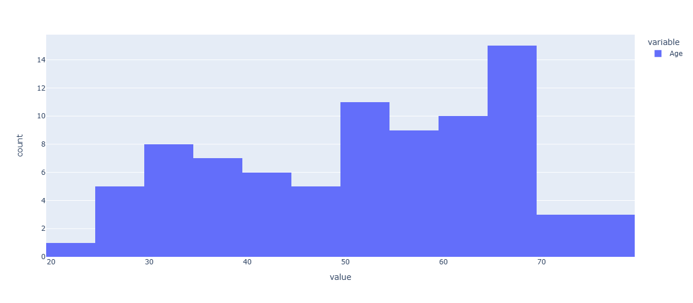
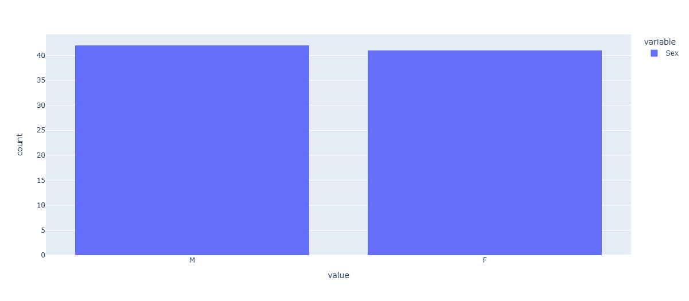
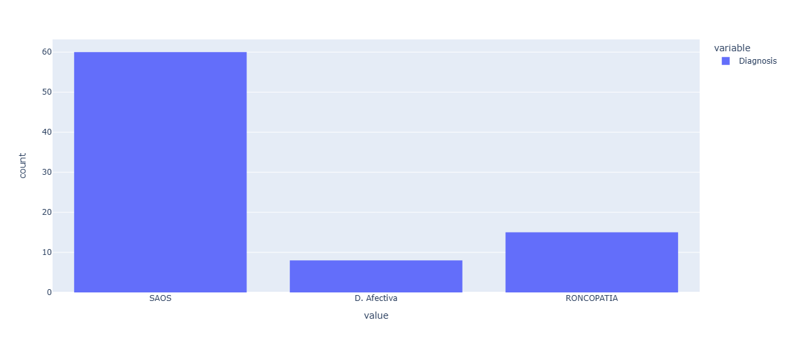

Utilizamos o conjunto de dados ISRUC-Sleep, que consiste em um banco de dados público abrangente, desenvolvido para auxiliar pesquisadores em estudos de fisiologia do sono e no desenvolvimento de métodos automáticos de classificação de estágios do sono (ASSC). Os dados foram coletados a partir de registros de polissonografia (PSG) realizados durante uma noite inteira, provenientes do Centro de Medicina do Sono do Hospital da Universidade de Coimbra (CHUC), Portugal, entre os anos de 2009 e 2013. O conjunto de dados é dividido em três subgrupos:

Subgrupo I: Contém registros de PSG de 100 indivíduos com evidências de distúrbios do sono. Cada sujeito possui uma sessão de aquisição de dados.
Subgrupo II: Inclui registros de PSG de 8 indivíduos com distúrbios do sono, cada um submetido a duas sessões de aquisição de dados em datas diferentes.
Subgrupo III: Contém registros de 10 indivíduos saudáveis, utilizados como grupo de controle, cada um com uma sessão de aquisição de dados.

Os registros de PSG consistem em 19 canais de sinais, incluindo eletroencefalograma (EEG), eletrooculograma (EOG), eletromiograma (EMG), eletrocardiograma (ECG), movimentos das pernas, ronco, fluxo de ar, esforço abdominal, oximetria de pulso e posição do corpo, entre outros. Os sinais de EEG, EOG e EMG foram amostrados a 200 Hz e armazenados no formato padrão EDF+.

Cada registro de PSG foi dividido em épocas de 30 segundos e marcado visualmente por dois especialistas em sono, de acordo com as diretrizes da American Academy of Sleep Medicine (AASM), proporcionando uma referência valiosa para a comparação de novos métodos de análise de padrões de sono.

O processamento dos dados foi realizado em um cluster de 16 computadores, cada um com as seguintes especificações técnicas:
Processador: Intel Core i5-9400F
Placa de Vídeo: NVIDIA RTX 2060 Super com 8GB de VRAM
Memória RAM: 8GB

Perfil do nosso público de estudo:

Distribuição de idade do público de estudo:

A figura mostra que a maioria do público estudado está entre 50 e 69 anos, com destaque para as faixas de 65 a 69 anos (15 pessoas), 60 a 64 anos (10 pessoas) e 55 a 59 anos (9 pessoas). As faixas etárias menores incluem poucos participantes, como 1 pessoa entre 20 e 24 anos e 3 pessoas entre 70 e 74 anos.

Distribuição por sexo do público de estudo.

A figura mostra que o público estudado está quase igualmente dividido entre os sexos, com 42 homens e 41 mulheres.

Distribuição de diagnósticos do público de estudo:

A figura mostra que a maioria do público estudado foi diagnosticada com Síndrome da Apneia Obstrutiva do Sono (SAOS) (60 pessoas), seguida por 15 pessoas com Roncopatia e 8 com outros diagnósticos. A SAOS envolve a obstrução parcial ou total das vias aéreas durante o sono, causando apneia (DRAGER et al., 2002). A Roncopatia, ou ronco, é um ruído inspiratório causado pela vibração dos tecidos moles da faringe que indica a obstrução da via aérea superior, o que dificulta a passagem do ar durante o sono (KAHWAGE, 2007).

O nosso conjunto de dados possui os seguintes parâmetros de avaliação do sono: saturação de oxigênio no sangue arterial (SaO2), frequência cardíaca (HR), movimentos periódicos das pernas (PLM), hipopneia central (CH), apneia central (CA), hipopneia obstrutiva (OH), apneia obstrutiva (OA), movimento rápido dos olhos (REM), despertar súbito (AR) e movimentos das pernas (LM).

Saturação de Oxigênio no Sangue Arterial (SaO2)

A saturação de oxigênio no sangue arterial é uma medida essencial para avaliar a qualidade da respiração e oxigenação durante o sono. É obtida por meio de um oxímetro, que utiliza comprimentos de onda de luz para medir a saturação de forma não invasiva. A SaO2 é uma medida importante para identificar possíveis distúrbios respiratórios durante o sono.

Frequência Cardíaca (HR)

A frequência cardíaca é o número de batimentos do coração por minuto. É um parâmetro importante para monitorar durante o sono, pois irregularidades podem estar relacionadas a distúrbios do sono, como a apneia.

Movimentos Periódicos das Pernas (PLM)

Os movimentos periódicos das pernas são movimentos repetitivos das pernas que ocorrem durante o sono em intervalos regulares. Esses movimentos podem interromper o sono, reduzindo sua qualidade e levando a sonolência diurna excessiva.

Hipopneia Central (CH)

A hipopneia central é uma condição respiratória em que há uma redução do fluxo respiratório devido à diminuição ou ausência de esforço respiratório por parte do sistema nervoso central, resultando em uma ventilação inadequada.

Apneia Central (CA)

A apneia central difere da apneia obstrutiva, pois nesta condição, a respiração é interrompida não por uma obstrução nas vias aéreas, mas por uma falha no cérebro em enviar sinais adequados para os músculos respiratórios, causando pausas na respiração.

Hipopneia Obstrutiva (OH)

A hipopneia obstrutiva caracteriza-se pela obstrução parcial das vias aéreas superiores, resultando em uma redução do fluxo de ar durante a respiração, sem interrupção completa. Pode estar associada à dessaturação de oxigênio no sangue.

Apneia Obstrutiva (OA)

A apneia obstrutiva ocorre quando há uma obstrução completa ou parcial das vias aéreas superiores durante o sono, resultando em pausas na respiração que podem durar vários segundos, levando à diminuição dos níveis de oxigênio no sangue e despertares frequentes.

Movimento Rápido dos Olhos (REM)

O movimento rápido dos olhos é a fase do sono em que ocorrem os sonhos mais vívidos. Durante essa fase, há um aumento na atividade cerebral, movimento rápido dos olhos, e paralisia temporária dos músculos esqueléticos, exceto aqueles responsáveis pela respiração e movimentação dos olhos.

Despertar Súbito (AR)

O despertar súbito refere-se a um despertar súbito ou a uma transição abrupta de uma fase mais profunda do sono para uma fase mais superficial. Isso pode ocorrer devido a distúrbios respiratórios ou outros fatores que interrompem o sono.

Movimentos das Pernas (LM)

Os movimentos das pernas são muitas vezes observados em indivíduos com síndrome das pernas inquietas ou outros distúrbios que envolvem movimento durante o sono.

Hipopneia Mista (MH)

A hipopneia mista refere-se a episódios de respiração superficial em que o fluxo de ar é reduzido para menos da metade do normal, geralmente acompanhada de dessaturação de oxigênio. Esse tipo de hipopneia é chamado de "mista" porque pode envolver características tanto de obstrução quanto de falha central.
